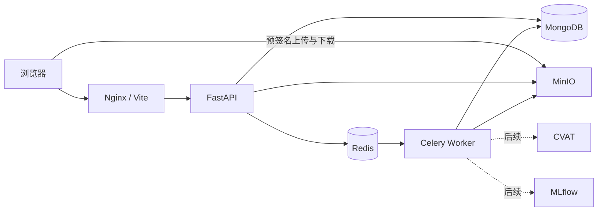

# 系统设计

## 目标与边界

系统统一归档图片、视频、标注、模型和压缩文件，提供检索、预览、关系管理、模型溯源、回收站与导出。首版不执行训练、推理、自动标注或模型效果评估。FiftyOne 只作为交互参考。

## 组件架构

API 保存业务元数据并签发 MinIO 地址。浏览器直接传输大文件。校验、媒体处理、数据集包导入、导出和物理清理由 Worker 执行。

## 核心集合

| 集合 | 关键字段 | 说明 |
| --- | --- | --- |
| `assets` | type, name, remark, object_key, sha256, size, mime_type, media, tags, status, archived_at | 文件元数据与处理状态 |
| `asset_versions` | asset_id, version, object_key, sha256, source, note | 资产版本 |
| `relations` | source_id, target_id, relation_type, status, provenance, revoke_reason | 有方向的资产关系 |
| `datasets`、`dataset_memberships` | name, status, asset_id, updated_at | 当前数据集及成员 |
| `dataset_versions`、`dataset_version_memberships` | version, member_count, content_digest, snapshot | 不可变版本与成员摘要 |
| `collections` | name, kind, asset_ids, revision, frozen_at | 旧集合兼容与迁移来源 |
| `saved_views` | owner_id, name, query, sort, fields, shared | 保存筛选规则 |
| `jobs` | type, state, progress, input, result, error, heartbeat_at, expires_at | 后台任务、取消状态和运行心跳 |
| `tag_definitions` | key, name, values, color, free_input, built_in | 标签字段配置及默认标签保护 |
| `format_definitions` | asset_type, extensions, protected_extensions, built_in, remark | 格式识别配置 |
| `users` | username, password_hash, status, roles | 用户与角色 |
| `audit_logs` | actor_id, action, object_type, object_id, changes, request_id | 只追加审计 |

## 素材与格式

持久素材类型包括 `image`、`video`、`annotation`、`model`、`archive` 和 `other`。`image_annotation` 是上传时手动选择的处理方式：Worker 成功导入后删除原压缩对象和临时资产，只保留解压得到的图片、标注及关系，因此素材库不展示“图片+标注”类型。

内置格式类别和扩展名不可修改、删除。默认标签可以修改但不允许删除；用户新增标签可以维护和删除，但已有素材正在使用时必须先迁移或移除对应标签。

## 标注导入与预览

“图片+标注”支持以下 CVAT 常用导出格式：

- YOLO Detection：同名图片与 TXT，类别来自 `data.yaml`、`obj.names` 等；
- Pascal VOC：图片和同名 XML；
- CVAT for images：统一 `annotations.xml`，按 `<image name>` 关联；
- COCO：JSON 中按 `images[].file_name` 关联。

同一压缩包出现多种有效标注格式时终止导入。当前绘制矩形框和多边形；Mask、关键点、骨架、旋转框、轨迹和视频逐帧标注暂不绘制。没有有效标注关系的图片显示“尚未建立图片与标注的对应关系”。

## 标签与筛选

标签字段支持配置名称、枚举值、颜色和自由输入。同一素材的同一标签可以保存多个值。素材备注是独立字段。

素材库支持名称和备注模糊搜索、素材类型、无标签以及标签、备注、创建时间、修改时间组合筛选。修改备注或标签会更新 `updated_at`。

## 关系

关系类型包括 `annotates`、`contains`、`trained_on`、`produced_by` 和 `version_of`。源与目标不能相同；前端选择器禁用自身，后端进行最终校验。

自动关联优先读取标注内容中的图片引用，没有引用时使用不区分大小写的文件基础名称。同名图片或同一图片被多个标注声明时列为冲突。提交前先预览，确认后批量创建。

图片与标注使用 `annotates` 关系。图片进入当前数据集时带入有效标注；撤销图片与标注关系后，只调整未发布的当前数据集，历史版本保持不变。模型只通过 `trained_on` 关系关联已发布的数据集版本，不再直接关联图片、视频、标注或压缩文件。图谱中的版本成员路径为只读推导结果，不额外写入模型直连关系。关系软撤销后从有效图谱移除，但保留历史和审计。

## 删除与导出

删除素材先进入回收站。还原会清除删除状态；清空回收站由后台任务物理删除 MinIO 对象和相关记录。

导出 ZIP 只包含所选原文件，同名文件自动增加标识避免覆盖。任务中心统一展示素材处理、素材导出、数据集导出和清空回收站任务，支持筛选、失败重试和导出取消。Worker 定期写入运行心跳，API 启动时恢复长时间无更新的异常任务。

## 安全与权限

访问令牌短期有效，刷新令牌可撤销，密码使用 Argon2 哈希。系统提供管理员、数据管理员、标注员、算法工程师和只读访客五类角色。所有关键写操作记录请求 ID 和审计事件。

开发环境首次启动创建 `admin/admin`。正式部署必须通过环境变量替换管理员密码、JWT 密钥和 MinIO 凭据。

## 已知限制

- 单机部署，不包含高可用、多租户和 Kubernetes；
- CVAT 和 MLflow 在线集成尚未实现；
- Linux Docker 全新部署和生产备份恢复尚未完成实机演练；
- 超大列表仍采用分页和分批加载，前端尚未使用虚拟滚动。
